# StrixTime [Task Manager App]

## Getting Started

A few resources to get you started if this is your first Flutter project:

- [Lab: Write your first Flutter app](https://flutter.dev/docs/get-started/codelab)
- [Cookbook: Useful Flutter samples](https://flutter.dev/docs/cookbook)

For help getting started with Flutter, view our
[online documentation](https://flutter.dev/docs), which offers tutorials,
samples, guidance on mobile development, and a full API reference.

## Description
* This application comes with an enhanced design and UI designed using Flutter. This application is very handy to use which helps you organize tasks and stay on top of your deadlines. App comes with handy features like you can edit or delete. You can use it to manage everything from grocery lists to work-related tasks and more.

## Author
* Sree Harsha - aka [HarshaStrix][website]
* My Portfolio Website - [(myfolio-strixblog)][website]

[website]: https://myfolio-strixblog.web.app/

## Screenshots
### Welcome Note Screens
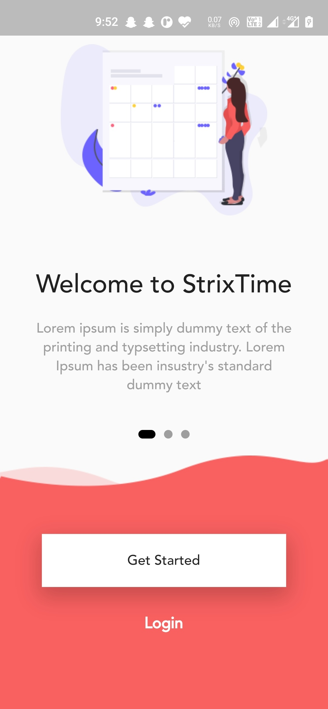 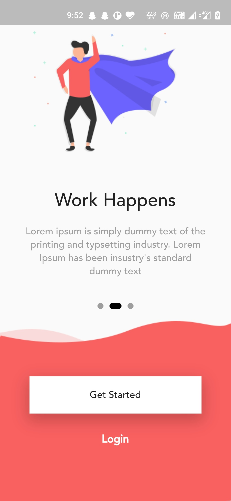 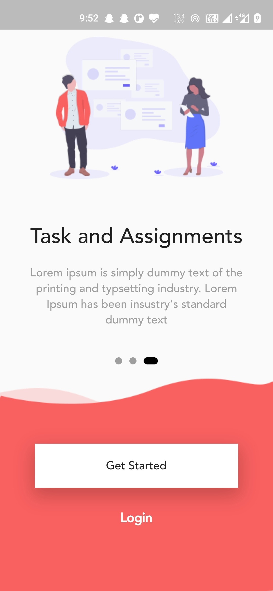

### Login Page
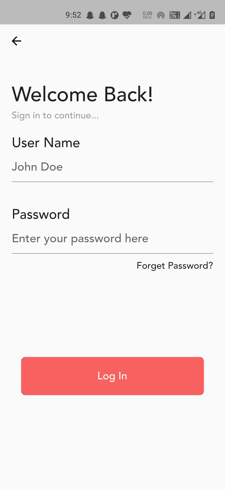

### Home Screen
#### Flexible screens
* Monthly and
* Everyday (Today) Tasks
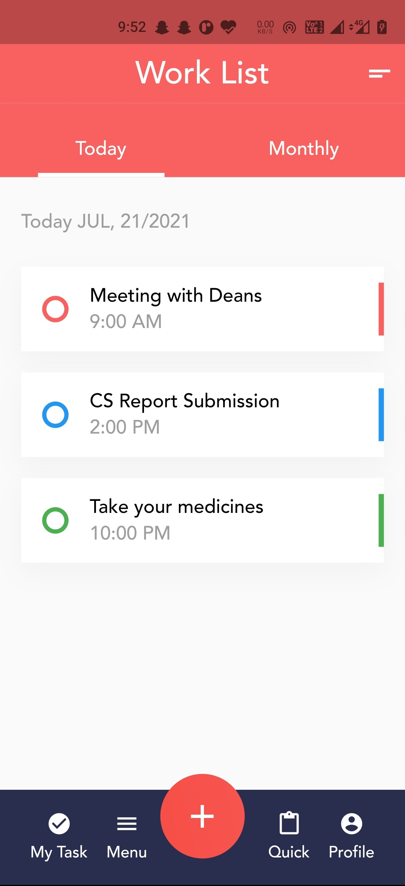   
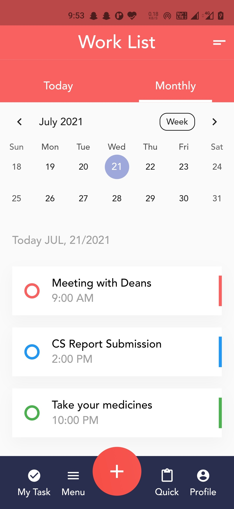

### New Task Function
#### Comes with 3 types of Adding Tasks
* Quick Note
* New Task
* CheckList
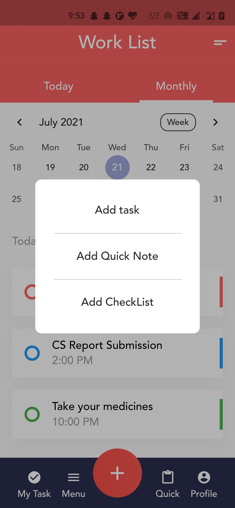

### New Task | New Quick Note | New CheckList
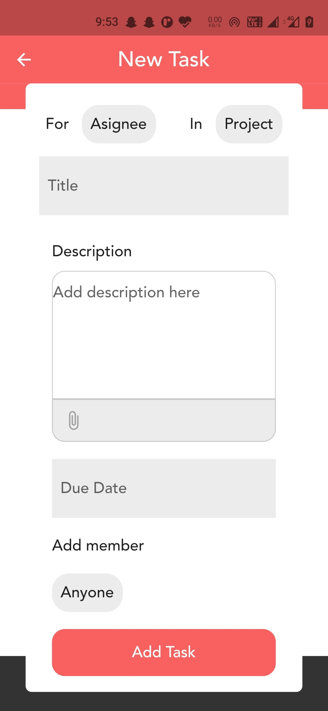 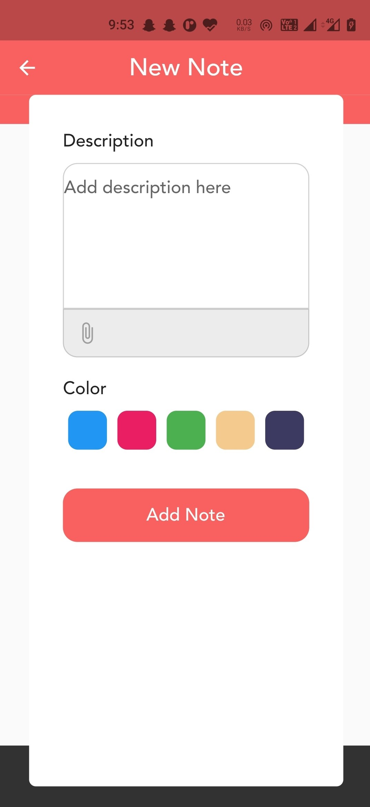 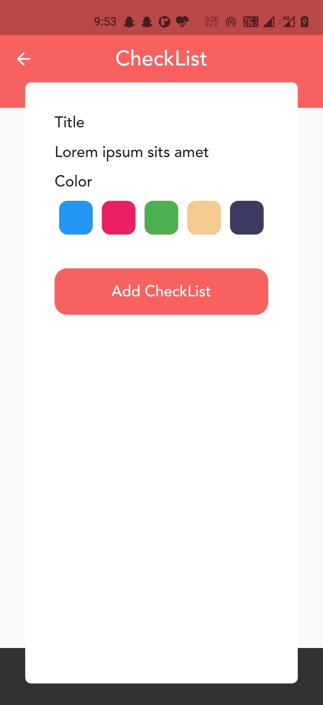

### Task Edit & Delete Functionality
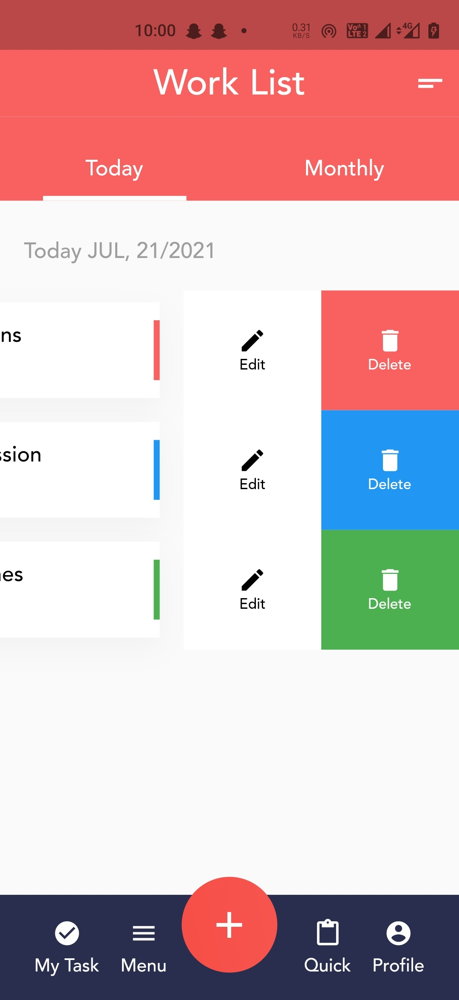 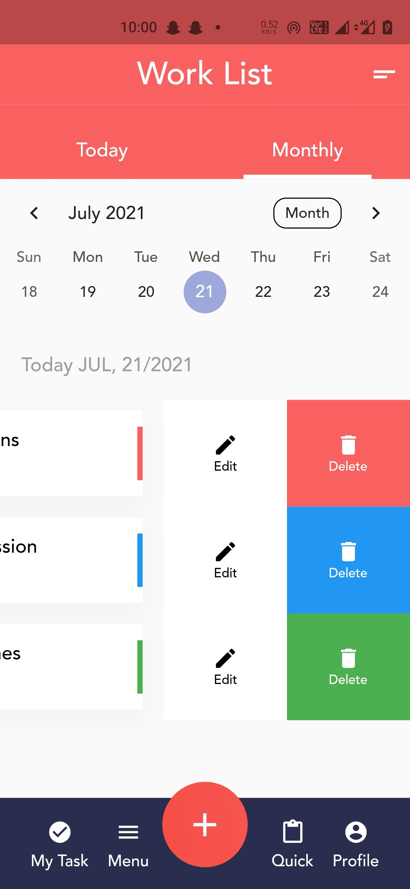 

### Forget Password Support 
* In case you forget your password.
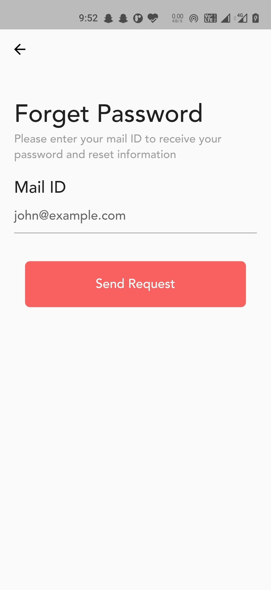

### Password Reset Page
* Comes with a 4-digit code for better security and verification purpose.
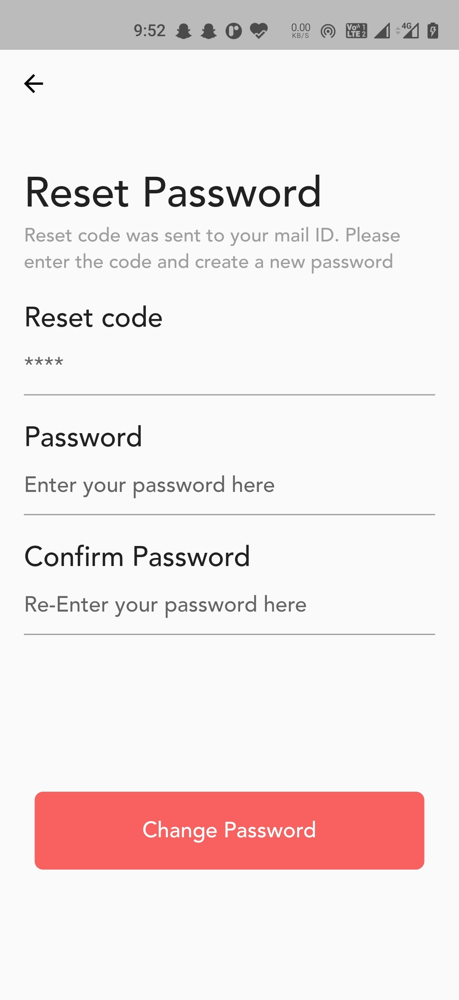 

### Upon Successful Reset of Password
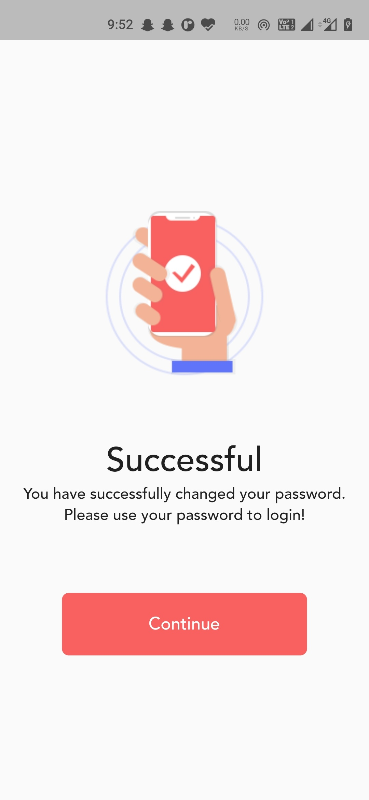

